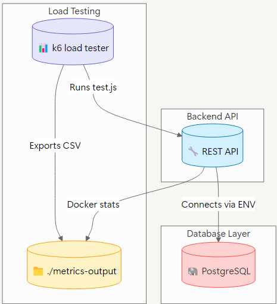

# 🧱 Architecture Overview

This document provides a visual and descriptive overview of the architecture used for the benchmark project comparing Spring, Quarkus, Micronaut, Go, and Rust stacks.

---

## 📌 Components Overview

The system is made of four main components:

- **📦 Backend API**: A REST API built with different frameworks (Spring, Quarkus, etc.)
- **🐘 PostgreSQL**: A relational database used by all stacks for persistent storage.
- **📊 k6 Load Testing**: Simulates HTTP traffic and records performance metrics.
- **📡 Monitor**: Collects metrics and stores them in shared volumes.

---

## 📸 Container Architecture

This diagram shows how all services are structured and how they interact in the benchmark setup:

---

## 🧬 Application Structure

This diagram shows the structure of the application and how its components interact to handle requests and perform operations in the benchmark setup:

 ## 🧪 Endpoints Tested and their purpose

| **Method**  | **Route**                     | **Function**                                                                  | **Purpose**                                    |
|-------------|-------------------------------|-------------------------------------------------------------------------------|------------------------------------------------|
|  **GET**     | /api/movies?title=…                | Search for a movie by title via OMDB API call                                 | Web Request: search for a movie by title in OMDB |
|  **POST**    | /api/movies                    | Add a movie directly to the database (with JSON data)                         | Direct database access (write)                  |
|  **GET**     | /api/movies/{id}               | Read a movie from the database by ID                                           | Direct database access (read)                   |
|  **GET**     | /api/internal/process          | Trigger an internal CPU-bound process (e.g., calculation, parsing)            | Benchmark heavy processes                       |
|  **GET**     | /api/health                    | Check if the API is up (simple "pong" response)                               | Verify API availability                         |
|  **GET**     | /api/movies/random             | Retrieve a random movie from the database                                      | Database query + server-side logic             |

---
